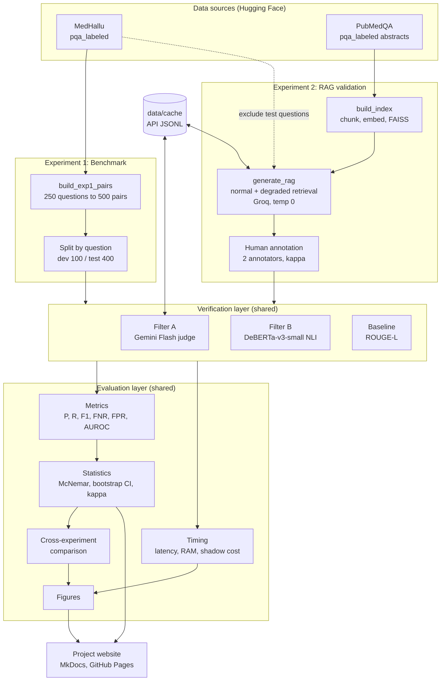
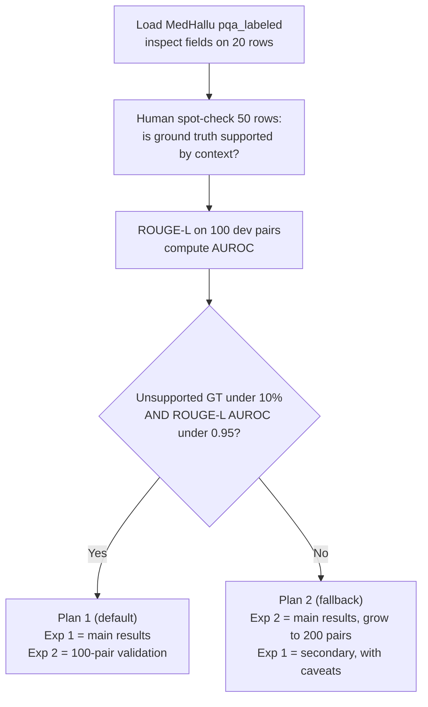
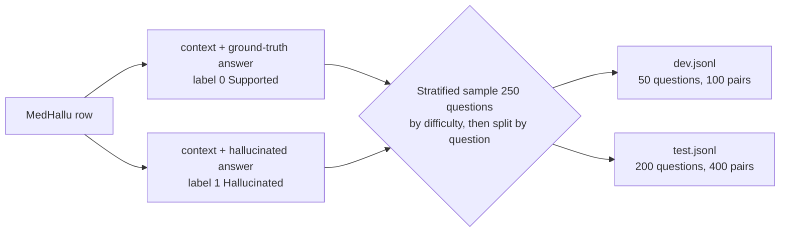
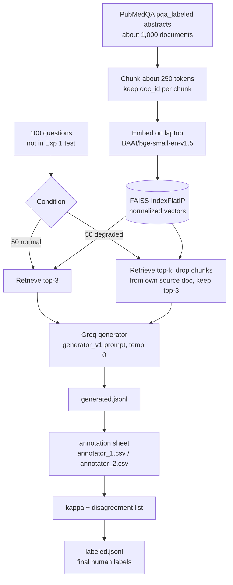
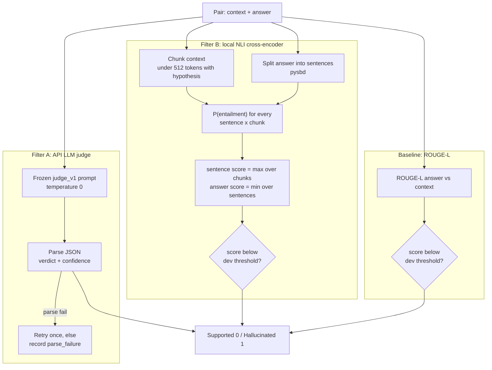
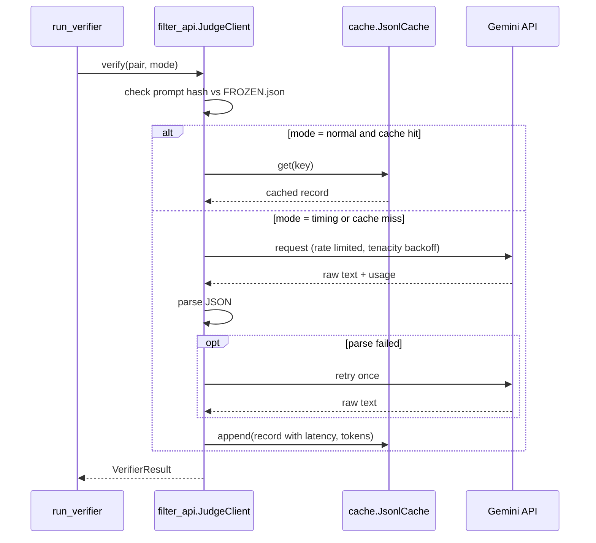
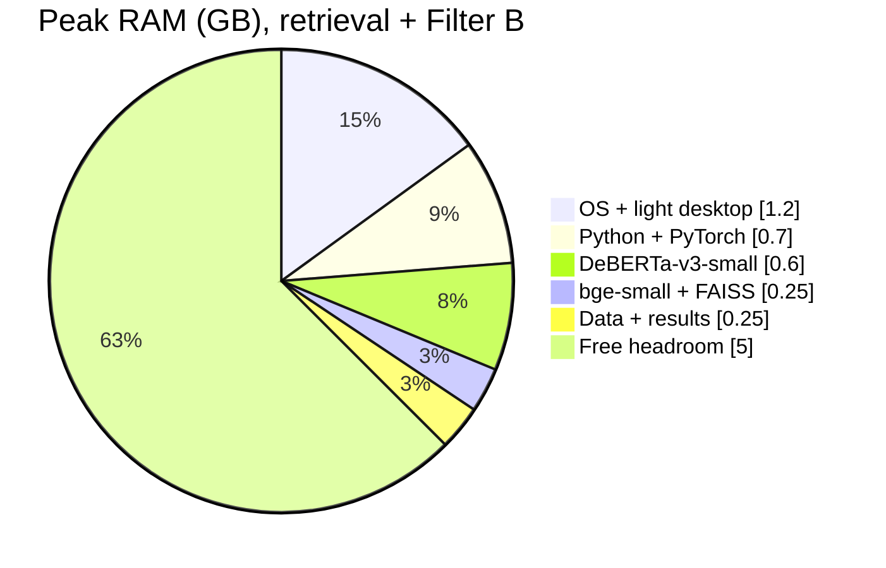
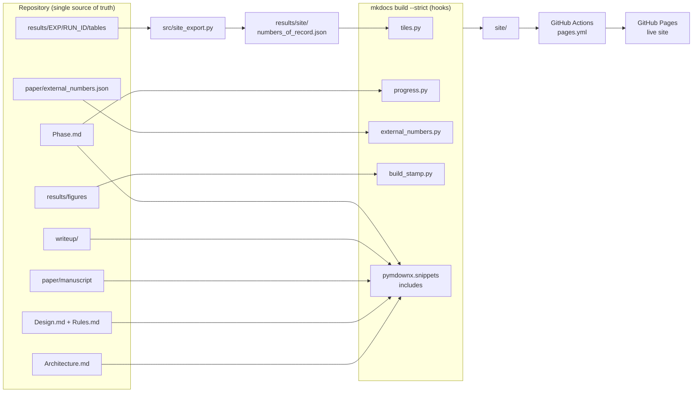
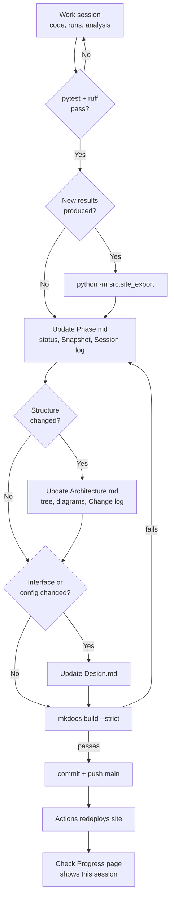

# Architecture.md

System architecture for the hallucination verifier study. Diagrams use Mermaid (renders in GitHub, VS Code, Antigravity, and the project website).

*Last updated: 2026-09-19, session 4. This file is updated in every session that changes structure (Rules R9.3). See the Change log at the end.*

## 1. System Overview

Two data sources feed one shared verification layer. Everything downstream (evaluation, statistics, figures) is shared too, so both experiments are measured the same way.



## 2. Week 1 Decision Gate

The pilot decides which experiment carries the headline results. The code must support both plans through config (`plan: 1` or `plan: 2`).



## 3. Experiment 1 Data Flow



## 4. Experiment 2 RAG Pipeline



## 5. Verifier Design



## 6. Filter A Call Sequence (Cache and Retry)



## 7. Module Dependency Graph

Arrows mean "imports". `common/` has no project imports, so it can be tested alone.

```mermaid
flowchart BT
    subgraph common["src/common"]
        CFG["config.py"]
        IO["io.py (JSONL, schemas)"]
        CA["cache.py"]
        LOG["logging_utils.py"]
        MAN["manifest.py"]
        TXT["text.py (sentences, chunking)"]
    end

    PIL["pilot_checks.py"] --> IO & CFG
    B1["build_exp1_pairs.py"] --> IO & CFG
    BI["build_index.py"] --> TXT & IO & CFG
    GR["generate_rag.py"] --> CA & IO & CFG
    AN["annotation.py"] --> IO & CFG
    FAPI["filters/filter_api.py"] --> CA & CFG
    FNLI["filters/filter_nli.py"] --> TXT & CFG
    FR["filters/baseline_rouge.py"] --> CFG
    BASE["filters/base.py"]
    FAPI --> BASE
    FNLI --> BASE
    FR --> BASE
    TUNE["tune_thresholds.py"] --> FNLI & FR & MET
    RUN["run_verifiers.py"] --> FAPI & FNLI & FR & MAN
    TIM["timing.py"] --> FAPI & FNLI & FR & MAN
    MET["evaluation/metrics.py"]
    ST["evaluation/stats.py"]
    EV["evaluate.py"] --> MET & ST & IO
    XE["cross_experiment.py"] --> MET & IO
    FG["figures.py"] --> IO
    SX["site_export.py"] --> IO & CFG
```



## 8. Runtime Memory Budget (8 GB)

Approximate peak for Exp 2 retrieval plus Filter B, taken from the methodology.



Filter A and the generator run over the network, so no large model is ever loaded locally.

## 9. Directory Structure

Extends the structure in Methodology C section 10. Original file names are kept; filters, evaluation, and shared utilities are grouped into subpackages.

```text
hallucination-verifier-c/
├── Agent.md                      # agent instructions (this doc set)
├── Rules.md
├── Architecture.md
├── Design.md
├── Phase.md
├── Website_Prompt.md             # build spec for the website
├── README.md                     # setup, how to reproduce, "not for clinical use"
├── pyproject.toml
├── mkdocs.yml                    # website config
├── requirements-docs.txt         # docs-only deps for CI (no torch)
│
├── .github/
│   └── workflows/
│       ├── ci.yml                # pytest + ruff
│       └── pages.yml             # mkdocs build --strict, deploy to Pages
│
├── hooks/                        # MkDocs build hooks (stdlib + PyYAML only)
│   ├── build_stamp.py            # commit SHA, build time, clinical notice
│   ├── tiles.py                  # {{ tile:key }} -> number tiles
│   ├── progress.py               # Phase.md Snapshot -> phase board
│   └── external_numbers.py       # verified published numbers table
│
├── docs/                         # website pages (thin wrappers, include root docs)
│   ├── index.md                  # Home: claim, status, numbers of record
│   ├── claim.md                  # one-sentence claim (researchers write)
│   ├── architecture.md           # --8<-- "Architecture.md"
│   ├── design.md
│   ├── rules.md
│   ├── progress.md               # board + --8<-- "Phase.md"
│   ├── manuscript/               # includes paper/manuscript/*
│   ├── writeup/                  # includes writeup/*
│   └── assets/
│       ├── extra.css
│       └── figures/              # copied from results/figures at build
│
├── paper/
│   ├── manuscript/               # 00-abstract.md ... 06-conclusion.md (living draft)
│   └── external_numbers.json     # published figures, human_verified flag
│
├── writeup/                      # bullet digests, every number sourced
│   ├── README.md
│   ├── 00-abstract.md ... 06-conclusion.md
│   └── rules/
├── uv.lock
├── .env.example                  # GROQ_API_KEY=, GEMINI_API_KEY=, HF_TOKEN=
├── .gitignore                    # .env, data/, results/*/raw/, *.index, logs/
│
├── configs/
│   ├── config.yaml               # all paths, model IDs, seeds, sizes, thresholds file
│   └── pricing.yaml              # judge prices + checked_on date (filled by humans)
│
├── prompts/
│   ├── judge_v1.txt              # Filter A prompt (frozen after dev)
│   ├── generator_v1.txt          # Exp 2 generator prompt (frozen before generation)
│   └── FROZEN.json               # {"judge_v1.txt": "<sha256>", ...}
│
├── data/                         # git-ignored
│   ├── raw/                      # HF snapshots at pinned revisions
│   ├── pilot/
│   │   ├── fields_20.json
│   │   ├── spotcheck_50.csv      # humans fill supported_yes_no
│   │   ├── rouge_results.json    # ROUGE-L AUROC per variant
│   │   └── pilot_report.json
│   ├── exp1_medhallu/
│   │   ├── dev.jsonl
│   │   └── test.jsonl
│   ├── exp2_rag/
│   │   ├── questions.jsonl       # 100 questions + condition
│   │   ├── corpus_chunks.jsonl
│   │   ├── faiss.index
│   │   ├── generated.jsonl
│   │   ├── annotation/
│   │   │   ├── template.csv
│   │   │   ├── annotator_1.csv
│   │   │   ├── annotator_2.csv
│   │   │   └── disagreements.csv
│   │   ├── labeled.csv           # final resolved labels (human)
│   │   └── labeled.jsonl         # validated conversion of labeled.csv
│   └── cache/
│       ├── judge_gemini.jsonl
│       └── generator_groq.jsonl
│
├── src/
│   ├── __init__.py
│   ├── common/
│   │   ├── config.py             # load + validate config.yaml
│   │   ├── io.py                 # JSONL read/write, pydantic schemas
│   │   ├── cache.py              # append-only JSONL cache with keys
│   │   ├── text.py               # sentence split, token-aware chunking
│   │   ├── manifest.py           # run_id, run_manifest.json, machine info
│   │   ├── prompts.py            # load prompt, verify hash vs FROZEN.json
│   │   └── logging_utils.py
│   ├── pilot_checks.py
│   ├── build_exp1_pairs.py
│   ├── build_index.py
│   ├── generate_rag.py
│   ├── annotation.py             # template export, kappa, disagreements, merge
│   ├── filters/
│   │   ├── base.py               # Verifier protocol + VerifierResult
│   │   ├── filter_api.py         # Filter A
│   │   ├── filter_nli.py         # Filter B
│   │   └── baseline_rouge.py     # Baseline
│   ├── tune_thresholds.py        # dev only, writes thresholds.json
│   ├── run_verifiers.py          # scores a split with all verifiers
│   ├── timing.py                 # latency, load time, peak RAM protocol
│   ├── evaluation/
│   │   ├── metrics.py            # P, R, F1, FNR, FPR, AUROC, cost
│   │   └── stats.py              # McNemar, bootstrap CI, kappa
│   ├── evaluate.py               # per-experiment tables + breakdowns
│   ├── cross_experiment.py       # ranking check + threshold transfer
│   ├── figures.py                # all paper figures
│   └── site_export.py            # results -> results/site/numbers_of_record.json
│
├── results/
│   ├── LATEST.json               # run_id of the valid run per experiment
│   ├── thresholds.json           # frozen decision thresholds tuned strictly on Exp 1 dev
│   ├── pilot/
│   │   ├── metrics.json          # pilot.unsupported_rate and pilot.rouge_auroc
│   │   └── pilot_report.md
│   ├── dev_tuning/               # dev split scoring outputs
│   ├── site/
│   │   ├── numbers_of_record.json   # only source of numbers on the website
│   │   └── README.md
│   ├── exp1/<run_id>/            # predictions, metrics, timing, manifest
│   ├── exp2/<run_id>/
│   ├── cross/<run_id>/
│   └── figures/                  # PNG + PDF, 300 dpi
│
├── notebooks/                    # exploration only, never source of reported numbers
│   └── 00_explore_medhallu.ipynb
│
├── tests/
│   ├── fixtures/                 # 10-row toy datasets
│   ├── test_baseline_rouge.py    # ROUGE-L precision/recall/fmeasure baseline
│   ├── test_cache.py             # cache key determinism & jsonl persistence
│   ├── test_config.py            # config loading & validation
│   ├── test_filter_api.py        # JSON parsing, retry, mocked client, frozen prompt check
│   ├── test_filter_nli.py        # max/min aggregation, label order
│   ├── test_io.py                # JSONL read/write, pydantic schemas
│   ├── test_leakage.py           # Exp 2 vs Exp 1 test & dev overlap = 0
│   ├── test_manifest.py          # run ID format and machine info capture
│   ├── test_metrics.py           # hand-computed metric examples
│   ├── test_pilot.py             # Gate G1 logic, ROUGE-L AUROC, CSV format
│   ├── test_prompts.py           # prompt loading, freezing & tampering detection
│   ├── test_split.py             # question disjointness & label balance
│   ├── test_stats.py             # McNemar test, bootstrap CI, kappa
│   ├── test_text.py              # sentence splitting & chunking
│   ├── test_timing.py            # timing benchmark protocol, warm-up discard, repeat passes
│   └── test_website.py           # snapshot table parsing, tiles & export
│
├── scripts/
│   ├── setup_env.sh
│   └── run_all.sh                # full pipeline from cache
│
├── site/                         # mkdocs build output, git-ignored
└── logs/                         # git-ignored
```

## 10. Layer Responsibilities

| Layer | Modules | Owns | Must not |
| --- | --- | --- | --- |
| Common | `src/common/*` | Config, schemas, cache, text utils, manifests | Import any other project module |
| Data build | `pilot_checks`, `build_exp1_pairs`, `build_index`, `generate_rag`, `annotation` | Creating validated JSONL datasets | Compute metrics |
| Verification | `filters/*`, `run_verifiers`, `tune_thresholds`, `timing` | Producing scores and verdicts | Read labels (except `tune_thresholds` on dev) |
| Evaluation | `evaluation/*`, `evaluate`, `cross_experiment` | Metrics, statistics, comparisons | Call any API or model |
| Presentation | `figures`, `site_export` | Plots, website numbers | Compute new metrics |
| Website | `mkdocs.yml`, `hooks/`, `docs/` | Rendering the record | Hold its own copy of any doc or number |

The key separation: **verifiers never see labels during scoring**, and **evaluation never calls models**. This makes leakage structurally hard.

## 11. Documentation Site and Update Loop

The website mirrors the repository. Root docs are included, not copied, and numbers flow only from results files, so the site cannot drift from the code as long as the session close procedure (Rules 9.2) runs.

### 11.1 How the site is built



### 11.2 Session update loop



### 11.3 What triggers which update

| Change in the session | Phase.md | Architecture.md | Design.md | Site effect |
| --- | --- | --- | --- | --- |
| Any commit | Session log, Last updated | | | Progress page |
| Task or checkbox finished | Checkbox, Snapshot state | | | Phase board |
| New or moved file, module, folder | Session log | Tree, diagram, Change log | If it has an interface | Architecture page |
| New dependency between modules | | Section 7 graph | | Architecture page |
| Config key or schema change | | | Sections 2 to 3 | Design page |
| New results run | Snapshot, sourced numbers | | | Home tiles via `site_export` |
| Result withdrawn | ⛔ with reason | | | Board shows ⛔ |
| Frozen artifact versioned (v2) | Session log, Snapshot | Tree if files added | Affected section | All pages |

## 12. Change log

Append one line per structural change. Never delete lines (Rules R9.9).

| Date | Session | Change |
| --- | --- | --- |
| YYYY-MM-DD | 0 | Initial architecture from Methodology C |
| YYYY-MM-DD | 0 | Added website layer (mkdocs, hooks, docs/, paper/, writeup/, site_export) |
| 2026-09-19 | 2 | pilot_checks.py implemented (stub → full). Added PilotConfig to config.py. Added tests/test_pilot.py. Added data/pilot/rouge_results.json to tree. |
| 2026-09-19 | 3 | Pinned generator (qwen/qwen3.8-27b) and judge (gemini-3.6-flash). Executed API smoke tests. Phase 2 executed (dev.jsonl, test.jsonl, split_summary.json). Implemented Baseline ROUGE-L, Filter B NLI, Filter A Gemini judge, evaluation metrics, evaluation stats, run_verifiers.py, tune_thresholds.py. Total test suite expanded to 101 tests (100% passing). |
| 2026-09-19 | 4 | Implemented build_index.py for PubMedQA chunking & FAISS index. Added generator_v1.txt and froze both prompts in FROZEN.json. Tuned dev thresholds (results/thresholds.json). Updated site_export to populate pilot.unsupported_rate and pilot.rouge_auroc. Isolated tile unit tests in test_website.py. Expanded test suite to 105 tests (100% passing). Synchronized all folder READMEs. |
| 2026-09-20 | 5 | Implemented and executed full generate_rag.py pipeline (200 answers generated via Groq qwen/qwen3.8-27b at temp 0). Fixed character encoding (utf-8) in io.py, build_index.py, build_exp1_pairs.py, prompts.py, config.py. Verified zero data leakage (test_leakage.py) and completed Phase 4. |
| 2026-09-20 | 6 | Implemented timing protocol in src/timing.py and tests/test_timing.py. Added PricingConfig to src/common/config.py and updated configs/pricing.yaml. Executed Phase 5 test evaluations for ROUGE-L and Filter B across 400 test pairs. Executed laptop CPU timing benchmarks for ROUGE-L and Filter B. Exported timing.filter_b.median_ms (332.1 ms) and cost.filter_a.per_1k_usd ($0.0575) to site numbers of record. |
| 2026-09-20 | 7 | Implemented Phase 6 human annotation tooling in src/annotation.py (export, kappa, merge) and tests/test_annotation.py. Exported 200 Experiment 2 pairs to template.csv, annotator_1.csv, annotator_2.csv, and annotation_guide.md. Total test suite expanded to 112 tests (100% passing). |
