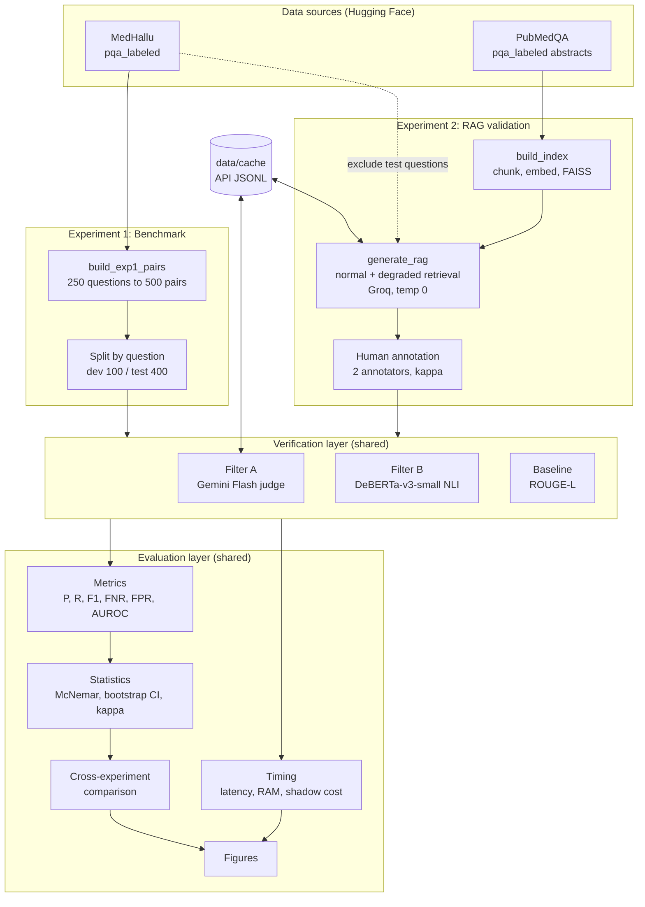
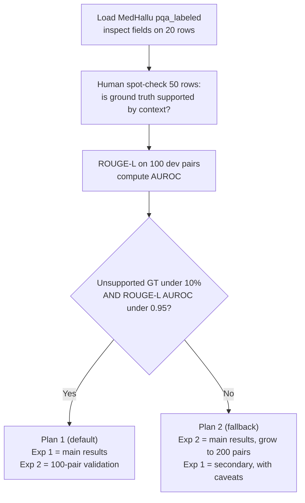
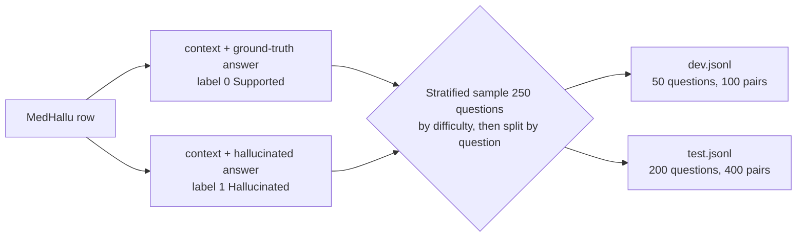
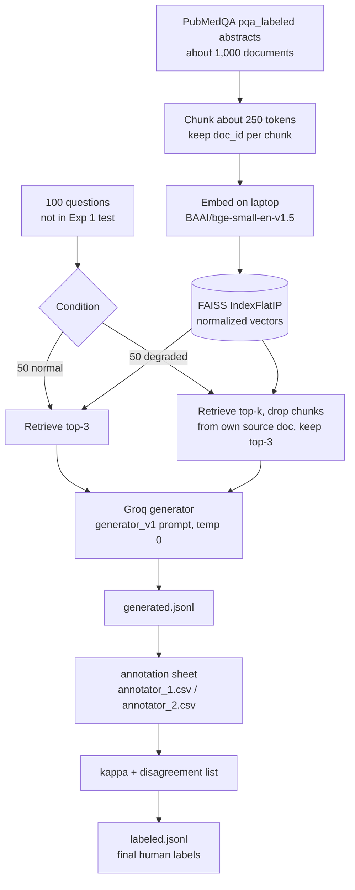
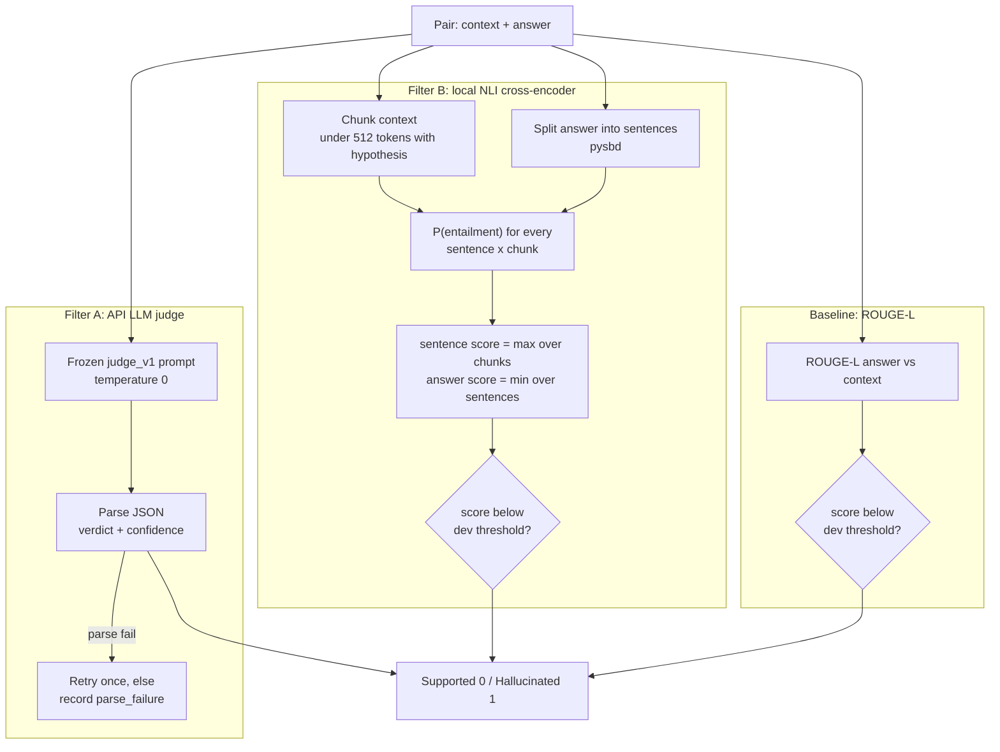
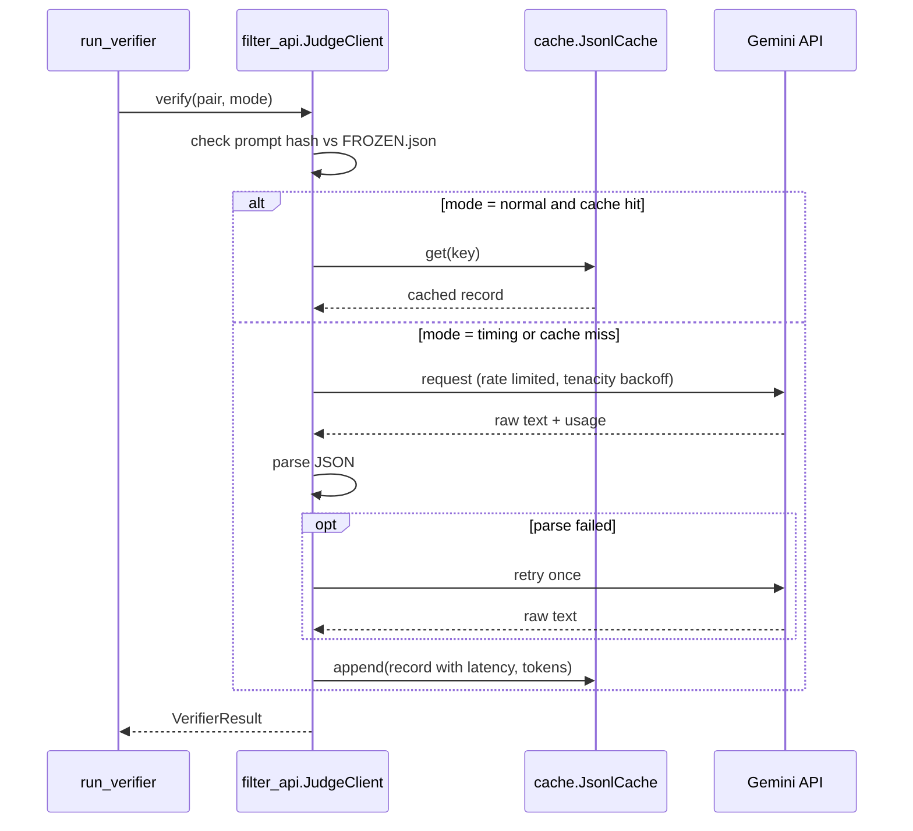
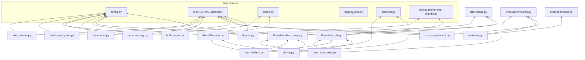
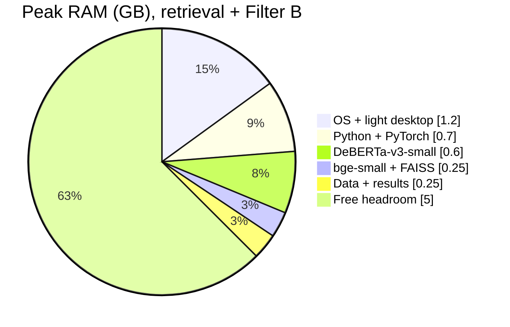

# Architecture.md

System architecture for the hallucination verifier study. Diagrams use Mermaid (renders in GitHub, VS Code, and Antigravity markdown preview).

## 1. System Overview

Two data sources feed one shared verification layer. Everything downstream (evaluation, statistics, figures) is shared too, so both experiments are measured the same way.



## 2. Week 1 Decision Gate

The pilot decides which experiment carries the headline results. The code must support both plans through config (`plan: 1` or `plan: 2`).



## 3. Experiment 1 Data Flow



## 4. Experiment 2 RAG Pipeline



## 5. Verifier Design



## 6. Filter A Call Sequence (Cache and Retry)



## 7. Module Dependency Graph

Arrows mean "imports". `common/` has no project imports, so it can be tested alone.



## 8. Runtime Memory Budget (8 GB)

Approximate peak for Exp 2 retrieval plus Filter B, taken from the methodology.



Filter A and the generator run over the network, so no large model is ever loaded locally.

## 9. Directory Structure

Extends the structure in Methodology C section 10. Original file names are kept; filters, evaluation, and shared utilities are grouped into subpackages.

```text
hallucination-verifier-c/
├── Agent.md                      # agent instructions (this doc set)
├── Rules.md
├── Architecture.md
├── Design.md
├── Phase.md
├── README.md                     # setup, how to reproduce, "not for clinical use"
├── pyproject.toml
├── uv.lock
├── .env.example                  # GROQ_API_KEY=, GEMINI_API_KEY=, HF_TOKEN=
├── .gitignore                    # .env, data/, results/*/raw/, *.index, logs/
│
├── configs/
│   ├── config.yaml               # all paths, model IDs, seeds, sizes, thresholds file
│   └── pricing.yaml              # judge prices + checked_on date (filled by humans)
│
├── prompts/
│   ├── judge_v1.txt              # Filter A prompt (frozen after dev)
│   ├── generator_v1.txt          # Exp 2 generator prompt (frozen before generation)
│   └── FROZEN.json               # {"judge_v1.txt": "<sha256>", ...}
│
├── data/                         # git-ignored
│   ├── raw/                      # HF snapshots at pinned revisions
│   ├── pilot/
│   │   ├── fields_20.json
│   │   ├── spotcheck_50.csv      # humans fill supported_yes_no
│   │   └── pilot_report.json
│   ├── exp1_medhallu/
│   │   ├── dev.jsonl
│   │   └── test.jsonl
│   ├── exp2_rag/
│   │   ├── questions.jsonl       # 100 questions + condition
│   │   ├── corpus_chunks.jsonl
│   │   ├── faiss.index
│   │   ├── generated.jsonl
│   │   ├── annotation/
│   │   │   ├── template.csv
│   │   │   ├── annotator_1.csv
│   │   │   ├── annotator_2.csv
│   │   │   └── disagreements.csv
│   │   ├── labeled.csv           # final resolved labels (human)
│   │   └── labeled.jsonl         # validated conversion of labeled.csv
│   └── cache/
│       ├── judge_gemini.jsonl
│       └── generator_groq.jsonl
│
├── src/
│   ├── __init__.py
│   ├── common/
│   │   ├── config.py             # load + validate config.yaml
│   │   ├── io.py                 # JSONL read/write, pydantic schemas
│   │   ├── cache.py              # append-only JSONL cache with keys
│   │   ├── text.py               # sentence split, token-aware chunking
│   │   ├── manifest.py           # run_id, run_manifest.json, machine info
│   │   ├── prompts.py            # load prompt, verify hash vs FROZEN.json
│   │   └── logging_utils.py
│   ├── pilot_checks.py
│   ├── build_exp1_pairs.py
│   ├── build_index.py
│   ├── generate_rag.py
│   ├── annotation.py             # template export, kappa, disagreements, merge
│   ├── filters/
│   │   ├── base.py               # Verifier protocol + VerifierResult
│   │   ├── filter_api.py         # Filter A
│   │   ├── filter_nli.py         # Filter B
│   │   └── baseline_rouge.py     # Baseline
│   ├── tune_thresholds.py        # dev only, writes thresholds.json
│   ├── run_verifiers.py          # scores a split with all verifiers
│   ├── timing.py                 # latency, load time, peak RAM protocol
│   ├── evaluation/
│   │   ├── metrics.py            # P, R, F1, FNR, FPR, AUROC, cost
│   │   └── stats.py              # McNemar, bootstrap CI, kappa
│   ├── evaluate.py               # per-experiment tables + breakdowns
│   ├── cross_experiment.py       # ranking check + threshold transfer
│   └── figures.py                # all paper figures
│
├── results/
│   ├── thresholds.json           # frozen after dev tuning
│   ├── pilot/
│   ├── exp1/<run_id>/            # predictions, metrics, timing, manifest
│   ├── exp2/<run_id>/
│   ├── cross/<run_id>/
│   └── figures/                  # PNG + PDF, 300 dpi
│
├── notebooks/                    # exploration only, never source of reported numbers
│   └── 00_explore_medhallu.ipynb
│
├── tests/
│   ├── fixtures/                 # 10-row toy datasets
│   ├── test_io.py
│   ├── test_split.py             # no question in both splits
│   ├── test_text.py
│   ├── test_filter_nli.py        # max/min aggregation, label order
│   ├── test_filter_api.py        # JSON parsing, retry, mocked client
│   ├── test_metrics.py           # hand-computed examples
│   ├── test_stats.py
│   └── test_leakage.py           # Exp 2 vs Exp 1 test overlap = 0
│
├── scripts/
│   ├── setup_env.sh
│   └── run_all.sh                # full pipeline from cache
│
└── logs/                         # git-ignored
```

## 10. Layer Responsibilities

| Layer | Modules | Owns | Must not |
| --- | --- | --- | --- |
| Common | `src/common/*` | Config, schemas, cache, text utils, manifests | Import any other project module |
| Data build | `pilot_checks`, `build_exp1_pairs`, `build_index`, `generate_rag`, `annotation` | Creating validated JSONL datasets | Compute metrics |
| Verification | `filters/*`, `run_verifiers`, `tune_thresholds`, `timing` | Producing scores and verdicts | Read labels (except `tune_thresholds` on dev) |
| Evaluation | `evaluation/*`, `evaluate`, `cross_experiment` | Metrics, statistics, comparisons | Call any API or model |
| Presentation | `figures` | Plots | Compute new metrics |

The key separation: **verifiers never see labels during scoring**, and **evaluation never calls models**. This makes leakage structurally hard.
