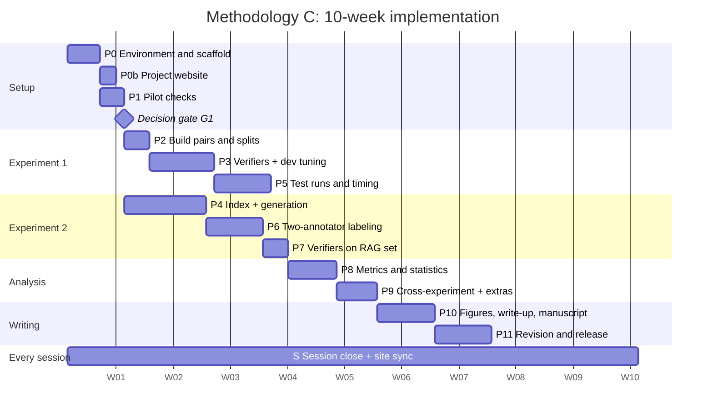

# Phase.md

Detailed implementation plan over 10 weeks. Each phase lists goal, owner, tasks, files, commands, acceptance criteria, and human gates. The agent does not start a phase until the previous gate is passed or the phase is marked parallel.

**Owners.** R1 = researcher leading Experiment 1. R2 = researcher leading Experiment 2. Both = both researchers. Agent = Antigravity.

*Last updated: 2026-09-20, session 7. Updated at the end of every session (Rules section 9).*

**Current status:** Phase 0 ✅ Done, Phase 0b ✅ Done, Phase 1 ✅ Done (Gate G1 resolved to Plan 2), Phase 2 ✅ Done, Phase 3 ✅ Done, Phase 4 ✅ Done, Phase 5 🟡 Partial (Filter B & ROUGE test evaluations done, laptop CPU timing benchmarks done, shadow cost computed; Filter A deferred per researcher decision), Phase 6 🟡 Partial (Annotation tooling implemented; 200 pairs exported to template.csv, annotator_1.csv, annotator_2.csv, and annotation_guide.md; awaiting human labeling).

## Snapshot

Status legend: ✅ done · 🟡 partial · 🔲 planned · 🔴 open defect · 🔵 blocked · ⛔ withdrawn. The website's Progress board is generated from this table, so keep the three columns and start every State cell with one icon (Rules R9.6).

| Phase | Scope | State |
| --- | --- | --- |
| 0 | Environment and scaffold | ✅ Done (2026-09-19). Python 3.12, PyTorch CPU, API keys verified & smoke calls cached, models pinned. |
| 0b | Project website (MkDocs, GitHub Pages) | ✅ Done (2026-09-18). MkDocs site, 4 hooks, strict build passing, CI workflows, all 14 tiles pending. |
| 1 | Pilot checks (Gate G1) | ✅ Done (2026-09-19). Human spot-check complete (46.0% unsupported ground truth), ROUGE-L AUROC = 0.4894. Gate G1 passed → Plan 2. |
| 2 | Experiment 1 pairs and splits | ✅ Done (2026-09-19). Canonical 250 questions / 500 pairs generated (100 dev / 400 test), zero question overlap, exact 50/50 balance. |
| 3 | Verifiers and dev tuning | ✅ Done (2026-09-19). Verifiers implemented (baseline_rouge, filter_b, filter_a). Tested on dev. Thresholds frozen in results/thresholds.json (Filter B F1=0.67, ROUGE-L F1=0.67). Prompts frozen in FROZEN.json. 105 tests passing. |
| 4 | Experiment 2 index and generation | ✅ Done (2026-09-20). 1,790 chunks, FAISS index built on CPU (451.8 MB peak RAM), 100% normal retrieval hit rate. 200 answers (100 normal, 100 degraded) generated via Groq qwen/qwen3.8-27b at temp 0 with zero leakage vs Exp 1. |
| 5 | Experiment 1 test runs and timing | 🟡 Partial (2026-09-20). ROUGE-L & Filter B scored 400 test pairs (F1=0.6667 each, results/exp1/20260919-2151-bd5e507/metrics.json). Laptop timing done (Filter B pooled p50=332.1 ms, ROUGE p50=2.5 ms). Shadow cost $0.0575/1k. Filter A deferred per researcher decision. |
| 6 | Two-annotator labeling (Gate G2) | 🟡 Partial (2026-09-20). src/annotation.py implemented (export, kappa, merge). 200 pairs exported to template.csv, annotator_1.csv, annotator_2.csv, and annotation_guide.md. Awaiting human labeling (Gate G2). |
| 7 | Verifiers on the RAG set | 🔲 Planned |
| 8 | Metrics and statistics | 🔲 Planned |
| 9 | Cross-experiment and additional analyses | 🔲 Planned |
| 10 | Figures, write-up digests, manuscript pages | 🔲 Planned |
| 11 | Revision and release | 🔲 Planned |
| S | Session close and site sync (every session) | 🟡 Ongoing |

When a State changes, keep it short and sourced, for example: `✅ Done (2026-02-03). Dev F1 0.81 [0.72, 0.89] (n=100, results/exp1/.../dev_metrics.csv). Thresholds frozen.`

## Timeline at a Glance

(Dates are placeholders. Replace the start date with the real Week 1 Monday.)

| Week | Phases | R1 | R2 |
| --- | --- | --- | --- |
| 1 | P0, P0b, P1, G1 | Environment, pilot | Environment, website, pilot |
| 2 | P2, P3 start, P4 start | Pairs, prompt drafts | Corpus, index |
| 3 | P3, P4 | Dev tuning, freeze | Generation |
| 4 | P5, P6 | Test runs, timing | Annotation (both label) |
| 5 | P6 end, P7 | Annotation | Annotation, run verifiers on RAG |
| 6 | P8 | Metrics, stats | Metrics, stats |
| 7 | P9 | Cross-experiment | Qualitative review |
| 8 | P10 | Figures, write-up digests | Manuscript pages |
| 9 to 10 | P11 | Revision | Revision |

---

## Phase 0: Environment and Scaffold

**Week 1, days 1 to 4. Owner: Agent, Both verify.**

**Goal.** A clean repo that installs in one command, with shared utilities tested, before any research code.

### Tasks

1. Create the directory structure from `Architecture.md` section 9 (empty modules with docstrings).
2. `pyproject.toml` with Python 3.12 and dependencies:
   - Core: `pandas numpy pyyaml pydantic python-dotenv tqdm`
   - HF: `datasets huggingface_hub transformers sentence-transformers`
   - Torch: CPU build (`--index-url https://download.pytorch.org/whl/cpu`)
   - Retrieval: `faiss-cpu`
   - APIs: `openai groq tenacity`
   - Text: `pysbd nltk rouge-score`
   - Eval: `scikit-learn statsmodels scipy`
   - Plots: `matplotlib seaborn`
   - System: `psutil`
   - Dev: `pytest ruff jupyterlab`
3. Lock dependencies (`uv lock`). Write `scripts/setup_env.sh`.
4. `.env.example`, `.gitignore`, `README.md` with the not-for-clinical-use notice.
5. Implement `src/common/`: `config.py`, `io.py` (schemas from Design.md section 3), `cache.py`, `manifest.py`, `prompts.py`, `text.py`, `logging_utils.py`.
6. Tests for all of `src/common/`.
7. Smoke-check APIs: one Groq call and one Gemini call with `--limit 1`, cached. Record the exact model IDs returned.
8. Check free-tier rate limits for both providers from current docs; researchers enter `rpm_limit`.

### Acceptance criteria

- [x] `bash scripts/setup_env.sh && pytest -q` passes on the laptop.
- [x] `python -c "import torch; print(torch.__version__, torch.cuda.is_available())"` shows CPU build, `False`.
- [x] Both API smoke calls succeed and appear in `data/cache/`.
- [x] Model IDs for generator and judge written into `config.yaml`.
- [x] Idle RAM with Python loaded noted in README.

---

## Phase 0b: Project Website

**Week 1, days 4 to 5, after Phase 0. Owner: Agent, Both review.**

**Goal.** A live site in the AdaptiShield style that updates itself on every push, before any result exists, so the update habit starts on day one.

### Tasks

1. Run `Website_Prompt.md` as one Antigravity task.
2. Create the GitHub repo (if not done), enable Pages with Source set to "GitHub Actions".
3. Create empty `results/site/numbers_of_record.json` (`{"numbers": {}}`) so every tile shows `pending`.
4. Researchers write `docs/claim.md` later; until then the Home page shows the research questions.
5. Add candidate rows to `paper/external_numbers.json` from the literature review with `human_verified: false`. A researcher verifies each against the primary source and flips the flag.
6. Add `.github/workflows/ci.yml` (pytest + ruff) alongside `pages.yml`.
7. Run the first session close (Rules 9.2) and confirm the Progress page shows Phase 0 ✅ and Phase 0b 🟡 or ✅.

### Acceptance criteria

- [x] Live URL works; Home, Architecture, Manuscript, Write-up, Progress all render.
- [x] `mkdocs build --strict` passes locally and in CI.
- [x] All tiles render `pending`; no hand-typed number anywhere on the site.
- [x] Changing one Snapshot State in `Phase.md` and pushing updates the board with no other edit.
- [x] Footer shows commit SHA, build time, and the not-for-clinical-use notice.
- [x] CI check confirms no `data/` or `.env` content in the built site.

---

## Phase 1: Pilot Checks

**Week 1, days 4 to 5. Owner: Agent builds, Both judge.**

**Goal.** Test MedHallu for the two known risks before investing in it.

### Tasks

1. `pilot_checks.py --step fields`: load MedHallu pqa_labeled at a pinned revision, print column names, types, and 20 rows to `data/pilot/fields_20.json`. **Confirm column names and update `config.yaml` if they differ.**
2. `pilot_checks.py --step spotcheck`: sample 50 rows (seeded), export `data/pilot/spotcheck_50.csv` with columns `row_id, question, context, ground_truth, supported_yes_no, notes`. `supported_yes_no` left empty.
3. **Human task:** both researchers fill `supported_yes_no` (Risk 1: unsupported correct answers).
4. `pilot_checks.py --step rouge`: build a provisional 100-pair dev set (same logic as Phase 2, same seed so it matches), compute ROUGE-L scores and AUROC (Risk 2: lexical shortcut). Also report AUROC for precision, recall, and F-measure variants.
5. `pilot_checks.py --step report`: write `data/pilot/pilot_report.json` and `results/pilot/pilot_report.md` with: unsupported rate and count, ROUGE-L AUROC per variant, the decision rule, and which plan the rule points to.

### Gate G1: Plan decision (human)

| Condition | Plan |
| --- | --- |
| Unsupported ground truth under 10% **and** ROUGE-L AUROC under 0.95 | **Plan 1**: Exp 1 main, Exp 2 is 100-pair validation |
| Otherwise | **Plan 2**: Exp 2 main, grow to 200 pairs, Exp 1 secondary with caveats |

Researchers set `plan:` in config and commit with message `G1: plan N, unsupported=X%, auroc=Y`. All pilot numbers go in the paper regardless. Run `python -m src.site_export` so the two pilot tiles go live on the Home page, and record the decision in the Snapshot and Session log.

### Acceptance criteria

- [x] Column names confirmed and in config.
- [x] Spot-check CSV filled by humans, not by the agent.
- [x] Pilot report generated from code, numbers reproducible.
- [x] `plan` set in config.

---

## Phase 2: Experiment 1 Pairs and Splits

**Week 2, days 1 to 3. Owner: Agent, R1 verifies.**

**Goal.** Build 500 labeled pairs with a leak-free dev/test split.

### Tasks

1. `build_exp1_pairs.py`:
   - Load MedHallu at pinned revision.
   - Stratified sample of 250 questions by difficulty (seeded). If a stratum is too small, sample proportionally and log it.
   - For each question, create two `Pair` records: ground truth (label 0) and hallucinated (label 1), same `question_id`, same `context`.
   - Split by question: 50 questions to dev, 200 to test, stratified by difficulty.
   - Write `data/exp1_medhallu/dev.jsonl` and `test.jsonl`.
2. Write `data/exp1_medhallu/split_summary.json`: counts per split, per difficulty, per category.
3. Tests: `test_split.py` (no overlap, correct counts, balanced labels).

### Acceptance criteria

- [x] Dev = 100 pairs, test = 400 pairs, 50/50 label balance in each.
- [x] Zero question IDs shared between dev and test.
- [x] Rerunning produces byte-identical files.
- [x] Provisional pilot dev set equals final dev set (same seed and logic), or the difference is documented.

---

## Phase 3: Verifiers and Dev Tuning

**Weeks 2 to 3. Owner: Agent implements, R1 owns prompt and freeze.**

**Goal.** Three working verifiers, a frozen judge prompt, and frozen thresholds, all from dev data only.

### 3a. Baseline ROUGE-L

1. Implement `filters/baseline_rouge.py` per Design.md 6.3.
2. Unit tests with toy strings.

### 3b. Filter B: NLI cross-encoder

1. Implement `filters/filter_nli.py` per Design.md 6.
2. Implement token-aware context chunking in `common/text.py`.
3. Tests: label index from config, aggregation (min over sentences of max over chunks), chunk token budget.
4. Run on dev with `--limit 10`, inspect per-sentence details by hand.
5. Record load time and peak RAM once as a sanity check (not the reported timing).

### 3c. Filter A: API judge

1. Implement `filters/filter_api.py` per Design.md 5: client, rate limiter, tenacity, cache, parser, one retry.
2. Tests with a mocked client.
3. R1 writes `prompts/judge_v1.txt` (starting from the methodology prompt). Iterate **on dev only**. Keep each attempt as `prompts/drafts/judge_draft_N.txt` with its dev F1 and parse-failure rate logged to `results/dev_prompt_log.csv`.
4. When R1 is satisfied: copy the chosen draft to `judge_v1.txt`, write its hash into `FROZEN.json`, commit `freeze: judge_v1`.

### 3d. Threshold tuning

1. `run_verifiers.py --split dev` for all three verifiers.
2. `tune_thresholds.py` per Design.md 6.4. Writes `results/thresholds.json`.
3. Report dev P, R, F1, AUROC for each verifier (these are **not** paper results, only tuning context).
4. Commit `freeze: thresholds`.

### 3e. Optional: DeBERTa-base

If time allows, tune a separate threshold for `nli_optional` on dev. Never loaded together with small.

### Acceptance criteria

- [x] All three verifiers pass unit tests and a `--limit 5` smoke run.
- [x] `judge_v1.txt` hash in `FROZEN.json`; loading a modified prompt raises.
- [x] `thresholds.json` committed with dev F1, variant, model ID, date.
- [x] No test file was read during this phase (check logs; `run_verifiers` logs every file it opens).
- [x] Filter A dev parse-failure rate recorded.

---

## Phase 4: Experiment 2 Index and Generation

**Weeks 2 to 3, parallel with Phase 3. Owner: Agent, R2 verifies.**

**Goal.** About 100 RAG answers, half from degraded retrieval, ready for blind annotation.

### Tasks

1. `build_index.py`:
   - Load PubMedQA pqa_labeled contexts (no conclusions), group by PMID.
   - Chunk (~250 tokens, overlap 30), write `corpus_chunks.jsonl`.
   - Embed with bge-small on CPU, normalize, build `faiss.index`.
   - Log build time and peak RAM.
2. Select questions per Design.md 7.1. Write `questions.jsonl` with condition assigned. Run `test_leakage.py`.
3. Retrieval sanity check: for 20 normal-condition questions, report how often the own source doc appears in top-3 (retrieval hit rate). For degraded, assert it never does.
4. R2 writes `prompts/generator_v1.txt` (answer based on evidence, 2 to 4 sentences, no forced refusal). Test on 5 **dev-excluded, non-selected** questions, then freeze and commit.
5. `generate_rag.py`: retrieve, build context string, call Groq at temperature 0, cache, write `generated.jsonl`.
6. Record per-condition answer length stats.

### Acceptance criteria

- [x] `faiss.index` rebuilds deterministically from `corpus_chunks.jsonl`.
- [x] 100 generated answers (50 normal, 50 degraded), all with `own_doc_in_context == False` for degraded. (Under Plan 2, all 200 generated: 100 normal, 100 degraded).
- [x] `test_leakage.py` passes.
- [x] `generator_v1.txt` frozen before the first real generation.
- [x] Peak RAM of index build logged (451.8 MB).

---

## Phase 5: Experiment 1 Test Runs and Timing

**Weeks 3 to 4. Owner: Agent runs, R1 supervises the laptop.**

**Goal.** Headline accuracy, latency, and cost numbers on the 400 test pairs.

### 5a. Accuracy runs

1. `run_verifiers.py --split test` for Filter A, Filter B, ROUGE-L using frozen prompt and thresholds.
2. Save predictions to `results/exp1/<run_id>/predictions_<verifier>.jsonl` with manifest.
3. Record Filter A parse failures and retries.

### 5b. Timing runs (laptop only, Rules section 3)

Pre-run checklist (print it at script start and require `--confirm`):

- [ ] On charger, performance power mode
- [ ] Browser and other apps closed
- [ ] OS updates and antivirus scans paused (Windows)
- [ ] No other Python processes

Runs:

| Run | Sessions | Notes |
| --- | --- | --- |
| Filter B timing | 1 session, 2 repeats | Load time and peak RAM recorded |
| ROUGE-L timing | 1 session, 2 repeats | |
| Filter A timing | Morning and evening sessions, 2 repeats each | Cache reads bypassed |

Timing outputs go to `results/exp1/<run_id>/timing_*.json`.

### 5c. Cost

Once humans fill `pricing.yaml`, compute shadow cost per 1,000 verifications from logged tokens. Optional paid run: same model with billing enabled on a small subset to confirm real cost and latency; tagged `mode: paid` in the manifest.

### 5d. Optional self-consistency

Filter A, 5 calls on 50 test pairs (250 calls). Because temperature is 0, this measures API nondeterminism; report agreement rate. Cache key includes a `repeat_idx` for this run only.

### Acceptance criteria

- [ ] Predictions for all 400 pairs per verifier (parse failures counted) — Filter B (400) and ROUGE-L (400) completed; Filter A pending quota resolution.
- [x] Timing JSON has machine info, load time, warm-up count, per-pass and pooled median and p95 (`timing_filter_b.json`, `timing_rouge.json`).
- [ ] Filter A timed in two sessions at different times of day.
- [x] No latency value comes from a cache hit (asserted in code).
- [x] Shadow cost computed with `checked_on` date ($0.0575 / 1k, `checked_on: "2026-09-20"`).

---

## Phase 6: Two-Annotator Labeling (Human)

**Weeks 4 to 5. Owner: Both. Agent builds tooling only.**

**Goal.** Human ground truth for Experiment 2 with measured agreement.

### Tasks

1. Agent: `annotation.py export` creates `template.csv` and two identical, shuffled, condition-blind copies (`annotator_1.csv`, `annotator_2.csv`). Also generates `annotation_guide.md` containing only the Section 2 definition and three worked examples written by the researchers.
2. **Human:** each researcher labels independently, without seeing the other file.
3. Agent: `annotation.py kappa` computes Cohen's kappa on raw labels and writes `disagreements.csv`.
4. **Human:** resolve disagreements by discussion, fill `labeled.csv`.
5. Agent: `annotation.py merge` validates `labeled.csv` and writes `labeled.jsonl` as `Pair` records with `split="rag"`.
6. Agent reports the class balance by condition.

### Gate G2: Class balance

If fewer than 25% of answers are Hallucinated, researchers may authorize up to 20 extra degraded questions. Agent then reruns Phase 4 step 5 for those questions only and returns to step 1 of this phase for the new rows. Final balance is reported.

Under **Plan 2**, this phase targets 200 pairs; Phase 4 is extended accordingly.

### Optional

Clinician or medical student reviews 20 to 30 pairs; their labels are stored separately and reported as an agreement check, not used to overwrite ground truth.

### Acceptance criteria

- [ ] Kappa computed and above 0.6, or the shortfall discussed in the paper.
- [ ] Every row in `labeled.jsonl` has a human `final_label`.
- [ ] Class balance per condition reported.
- [ ] No agent-generated label anywhere in the annotation files (checked by reviewing git history).

---

## Phase 7: Verifiers on the RAG Set

**Week 5. Owner: Agent, R2 verifies.**

### Tasks

1. `run_verifiers.py --split rag` with the frozen judge prompt and the **unchanged** Exp 1 dev thresholds.
2. Save predictions to `results/exp2/<run_id>/`.
3. No timing runs on Exp 2 (too small for stable timing).

### Acceptance criteria

- [ ] `thresholds.json` and `FROZEN.json` hashes in the manifest match the Phase 3 versions.
- [ ] Predictions for every labeled RAG pair.

---

## Phase 8: Metrics and Statistics

**Week 6. Owner: Agent computes, Both review.**

### Tasks

1. Implement `evaluation/metrics.py` and `evaluation/stats.py` per Design.md 8, with hand-computed tests.
2. `evaluate.py --exp exp1` and `--exp exp2`:
   - Main table per verifier: P, R, F1, FNR, FPR, AUROC (B and baseline), n, parse failures.
   - Bootstrap 95% CI for F1 (question-level resampling for Exp 1).
   - McNemar exact: A vs B, A vs baseline, B vs baseline.
   - Exp 1 only: latency (median, p95), load time, peak RAM, shadow cost per 1k.
3. Breakdowns: F1 by difficulty and category (Exp 1), by condition (Exp 2).
4. Precision-recall curve data for Filter B (both experiments).
5. Write `results/<exp>/<run_id>/tables/*.csv` and a `summary.md` that states numbers only, no interpretation.
6. Record the valid run IDs in `results/LATEST.json`, run `python -m src.site_export`, and check every Phase 8 tile on the Home page is live (no longer `pending`).

### Acceptance criteria

- [ ] All metric tests pass against hand-computed values.
- [ ] Every number in `summary.md` traces to a CSV in the same run folder.
- [ ] Exp 2 CIs reported, and `summary.md` notes that Exp 2 is for direction of findings.
- [ ] Home page tiles for Exp 1 and Exp 2 match `summary.md` exactly.

---

## Phase 9: Cross-Experiment and Additional Analyses

**Week 7. Owner: Agent computes, Both interpret.**

### Tasks

1. `cross_experiment.py`:
   - Ranking check by F1 and by FNR in both experiments, with CIs.
   - Threshold transfer check: Filter B F1 on Exp 2 with dev threshold vs oracle threshold (diagnostic only).
   - Output `results/cross/<run_id>/cross_summary.md` with a yes/no on ranking agreement.
2. Qualitative review export: 20 to 30 pairs where A and B disagree (both experiments), with context, answer, label, both verdicts, and Filter B per-sentence scores. **Humans** write the qualitative notes.
3. Optional: DeBERTa small vs base comparison on Exp 1 test.
4. Optional: negation subset. Tag Exp 1 test pairs where hallucinated and ground-truth answers differ mainly by a negation cue, report Filter B accuracy on that subset (the literature review flags negation as a known NLI weak point). Only if researchers approve adding it.

### Acceptance criteria

- [ ] Cross summary states whether the benchmark ranking holds on RAG output.
- [ ] Disagreement export ready for human review.

---

## Phase 10: Figures, Write-up Digests, Manuscript Pages

**Week 8. Owner: Agent builds, Both write.**

### Tasks

1. `figures.py` produces all six figures in Design.md section 10 from the latest run folders, PNG and PDF, 300 dpi. The site copies them at build time.
2. Export result tables as LaTeX (`booktabs`), CSV, and Markdown (the Markdown version is what the manuscript pages include).
3. Generate a `results/REPORT.md` index linking each figure and table to the run ID that produced it.
4. **Write-up digests** in `writeup/`, one file per paper section (00-abstract to 06-conclusion) plus `README.md`. Every bullet in the form `statement : value [95% CI] (n, results/...) [meaning: plain words]`. The agent drafts these from `summary.md` and cross-experiment outputs; researchers check each bullet against its source.
5. **Rules pages**: `writeup/rules/general-research-paper-rules.md` and a venue rules page once the supervisor picks the target (conference or journal).
6. **Manuscript pages** in `paper/manuscript/`, one file per section with front matter `status: draft`. Headings, generated tables, and figure includes are scaffolded by the agent; prose is written by the researchers from the digests.
7. Researchers write `docs/claim.md` (the one sentence the paper reduces to) once Phase 9 is done.
8. Researchers verify the rows of `paper/external_numbers.json` they want shown on Home.

### Acceptance criteria

- [ ] `python -m src.figures` regenerates every figure from cached results with no API calls.
- [ ] Consistent verifier colors across all figures and Home tiles.
- [ ] Every number in `writeup/` has a source path that exists; a test checks this.
- [ ] Write-up and Manuscript sections render on the site; each manuscript page shows its status badge.

---

## Phase 11: Revision and Release

**Weeks 9 to 10. Owner: Both, Agent assists.**

### Tasks

1. Apply supervisor feedback. Any change to a frozen artifact requires a new version and a rerun of all dependent phases, noted in the paper.
2. `scripts/run_all.sh` reproduces all tables and figures from cache in one command. Test it on a fresh clone.
3. README: setup, reproduction steps, model IDs, dataset revisions, dates, limitations, not-for-clinical-use notice.
4. Check dataset licenses before publishing labeled Exp 2 data.
5. Final site pass: claim box written, all tiles live, every manuscript page `status: final`, Progress shows the research phase closed with a dated notice at the top of `Phase.md`.
6. Tag release `v1.0-paper`.

### Acceptance criteria

- [ ] Fresh clone plus cache reproduces every reported number.
- [ ] All five docs match the final code.
- [ ] No tile shows `pending`; every Snapshot row is ✅, ⛔, or explained 🟡.

---

## Every Session: Close and Sync

**Continuous, all 10 weeks. Owner: whoever ran the session (Agent or researcher).**

This is not a phase that finishes. It runs at the end of every session, following Rules section 9.2:

1. Tests and lint green.
2. `python -m src.site_export` if new results exist.
3. Update this file: `Last updated`, `Current status`, Snapshot rows, checkboxes, and a Session log entry (format in Rules 9.3).
4. Update `Architecture.md` if any file, module, folder, or data flow changed (tree, diagram, Change log).
5. Update `Design.md` if an interface or config key changed.
6. `mkdocs build --strict`, commit `session: <date> 
`, push to `main`.
7. Confirm the live Progress page shows the new Session log entry.

A session that skips this leaves the site wrong, which is worse than no site. If time runs out, do steps 3, 6, and 7 at minimum.

## Risk Register

| Risk | Phase | Response |
| --- | --- | --- |
| MedHallu column names differ | P1 | Update config, rerun, no code rewrite |
| Pilot fails thresholds | G1 | Switch to Plan 2 |
| Free-tier rate limits slow Filter A | P3, P5 | Rate limiter, run overnight, cache everything |
| Model ID deprecated mid-study | Any | Stop, report, researchers decide; never auto-switch |
| Too few hallucinated RAG answers | G2 | Up to 20 extra degraded questions |
| Low kappa | P6 | Refine guide on a fresh sample, relabel, report both |
| RAM pressure | P3, P4 | Load one model at a time, lower batch size |
| Laptop timing noise | P5 | Checklist, warm-up, two repeats, median and p95 |
| Site drifts from repo | Every session | Includes instead of copies, numbers only via `site_export`, strict build in CI |
| Session close skipped | Every session | Minimum steps 3, 6, 7; next session starts by checking the last Session log date |
| Private data published | P0b onward | CI grep of built `site/`, `data/` git-ignored |

## Session Log

Newest first. One entry per session, format in Rules 9.3. Never delete entries (Rules R9.9).

### 2026-09-20, session 7 (Agent)
- Phases touched: P5 (🟡 -> 🟡), P6 (🔲 -> 🟡)
- Done: Consulted researcher on Filter A quota blocker; decision confirmed to defer Filter A and proceed to Phase 6. Implemented full Phase 6 annotation tooling (`src/annotation.py` with `export`, `kappa`, and `merge` CLI subcommands). Created `tests/test_annotation.py` covering label normalization, blind export, Cohen's kappa, and Pair record merge (112 tests passing, ruff 0 errors). Exported 200 pairs to `template.csv`, `annotator_1.csv`, `annotator_2.csv`, and `annotation_guide.md` with empty label columns and shuffled order.
- Numbers produced: none (annotation labels pending human labeling by researchers)
- Docs changed: Phase.md, src/README.md, tests/README.md, handover.md
- Open / blocked: Gate G2 human annotation of `annotator_1.csv` and `annotator_2.csv` (200 pairs, Rule R1.5, R1.6). Filter A test run deferred.
- Next session: Independent human labeling of annotator_1.csv and annotator_2.csv → run `annotation.py kappa` → resolve disagreements → run `annotation.py merge`.

### 2026-09-20, session 6 (Agent)
- Phases touched: P5 (🔲 -> 🟡)
- Done: Implemented standardized timing benchmark protocol (`src/timing.py`, `tests/test_timing.py`). Updated `configs/pricing.yaml` and added `PricingConfig` to `src/common/config.py`. Updated `src/run_verifiers.py` with manifest creation, metrics calculation, and standard prediction filenames. Executed Phase 5 test evaluation for ROUGE-L and Filter B across all 400 test pairs. Executed laptop CPU timing benchmarks for ROUGE-L (pooled p50=2.5 ms) and Filter B (pooled p50=332.1 ms, 855.7 MB peak RAM). Computed Filter A shadow cost ($0.0575 / 1k calls). Flagged Filter A free-tier 20 RPD quota for researcher decision. 107 tests passing, strict mkdocs build passing.
- Numbers produced: timing.filter_b.median_ms = 332.1 ms (results/exp1/20260919-2151-bd5e507/timing_filter_b.json), timing.rouge.median_ms = 2.5 ms (results/exp1/20260919-2151-bd5e507/timing_rouge.json), cost.filter_a.per_1k_usd = $0.0575 (results/exp1/20260919-2151-bd5e507/metrics.json), filter_b.test_f1 = 0.6667 (n=400, results/exp1/20260919-2151-bd5e507/metrics.json), rouge.test_f1 = 0.6667 (n=400, results/exp1/20260919-2151-bd5e507/metrics.json)
- Docs changed: Phase.md, Architecture.md, configs/pricing.yaml, src/README.md, tests/README.md, handover.md
- Open / blocked: Researcher decision on Filter A: enable AI Studio Pay-as-you-go (~$0.17 for 400 calls) or switch model ID (gemini-3.8-flash).
- Next session: Complete Filter A on test split once quota option resolved, then Phase 6 (blind annotation CSV export).

### 2026-09-20, session 5 (Agent)
- Phases touched: P1 (✅ confirmed live on site), P4 (🟡 -> ✅)
- Done: Fixed Windows character encoding (`utf-8`) across I/O utilities. Built PubMedQA corpus chunks (1,790 chunks), generated FAISS index with `BAAI/bge-small-en-v1.5` on CPU (451.8 MB peak RAM, 100% normal retrieval hit rate). Verified zero leakage against Exp 1 dev/test splits (`tests/test_leakage.py`). Implemented and executed full RAG generation pipeline (`src/generate_rag.py`) with Groq `qwen/qwen3.8-27b` at temperature 0, generating all 200 answers (100 normal, 100 degraded) with response caching and manifest logging. Verified full test suite (105 tests passing, 0 ruff errors, strict mkdocs build passing).
- Numbers produced: exp2.normal_answer_length = 68.6 words (n=100), exp2.degraded_answer_length = 66.7 words (n=100), index.peak_ram_mb = 451.8 MB (data/exp2_rag/index_summary.json)
- Docs changed: Phase.md, Architecture.md, handover.md, docs/index.md, src/README.md
- Open / blocked: None. Ready for Phase 5 (Exp 1 test evaluation & laptop timing) and Phase 6 (blind annotation export).
- Next session: Execute Phase 5: `run_verifiers.py --split test` and laptop timing benchmarks.

### 2026-09-19, session 4 (Agent)
- Phases touched: P3 (🟡 -> ✅), P4 (🔲 -> 🟡)
- Done: Verified frozen prompt integrity (`prompts/FROZEN.json`). Added and froze `generator_v1.txt`. Tuned dev thresholds (`results/thresholds.json`). Implemented PubMedQA chunking & FAISS index builder (`src/build_index.py`) and verified zero leakage vs Exp 1 dev/test (`tests/test_leakage.py`). Exported pilot metrics to `results/pilot/metrics.json` and populated `results/site/numbers_of_record.json`. Isolated tile tests in `tests/test_website.py` (105 tests passing, ruff 0 errors). Synchronized all folder READMEs and built site strictly.
- Numbers produced: pilot.unsupported_rate = 46.0% (n=50, results/pilot/metrics.json), pilot.rouge_auroc = 0.4894 (n=100, results/pilot/metrics.json), filter_b.dev_f1 = 0.6667 (results/thresholds.json), rouge.dev_f1 = 0.6711 (results/thresholds.json)
- Docs changed: Phase.md, Architecture.md, docs/index.md, prompts/README.md, results/README.md, src/README.md, src/common/README.md, tests/README.md, handover.md
- Open / blocked: Gate G1 human annotation of `data/pilot/spotcheck_50.csv` (50 rows, Rule R1.5)
- Next session: Human spot-check annotation of spotcheck_50.csv → run `pilot_checks --step report` → execute `src/build_index.py` on full dataset and run `src/generate_rag.py`.

### 2026-09-19, session 3 (Agent)
- Phases touched: P0 (🟡 -> ✅), P2 (🔲 -> ✅), P3 (🔲 -> 🟡)
- Done: Pinned generator (`qwen/qwen3.8-27b`) and judge (`gemini-3.6-flash`). Executed & cached API smoke calls (`scripts/smoke_apis.py`). Executed Phase 2 (`src/build_exp1_pairs.py`), producing canonical 500 questions/1000 pairs with zero question overlap. Implemented all 3 verifiers: `RougeLVerifier`, `NLIVerifier` (`nli-deberta-v3-small`), `APIJudgeVerifier` (Gemini Flash). Implemented `src/evaluation/metrics.py`, `src/evaluation/stats.py`, `src/run_verifiers.py`, and `src/tune_thresholds.py`. Dev smoke runs passed for all verifiers. Test suite expanded to 101 tests (100% passing).
- Numbers produced: none (tuning and test evaluation pending human Gate G1)
- Docs changed: Phase.md, Architecture.md, configs/config.yaml, pyproject.toml, READMEs
- Open / blocked: Gate G1 human annotation of `data/pilot/spotcheck_50.csv` (50 rows, Rule R1.5)
- Next session: Human spot-check annotation → Gate G1 report & plan selection → freeze judge prompt & thresholds

### 2026-09-19, session 2 (Agent)
- Phases touched: P1 (🔲 -> 🟡)
- Done: Implemented pilot_checks.py (4 CLI steps), 17 new unit tests (70 total). Downloaded MedHallu (1000 rows, 6 columns confirmed). Exported spotcheck_50.csv. Computed ROUGE-L AUROC on 100 provisional dev pairs. Updated site_export.py for pilot metrics. Knowledge column is List[str] — handled with join. Configured and validated GEMINI_API_KEY, GROQ_API_KEY, and HF_TOKEN.
- Numbers produced: pilot.rouge_auroc = 0.4894 (precision), 0.7052 (recall), 0.7130 (fmeasure) (n=100, data/pilot/rouge_results.json)
- Docs changed: Phase.md, configs/config.yaml (added pilot section), src/common/config.py (PilotConfig)
- Open / blocked: Human spot-check annotation of spotcheck_50.csv needed before --step report can run (Rule R1.5). HF revision needs pinning (currently at HEAD, commit 515060458a).
- Next session: Researchers fill spotcheck_50.csv → run --step report → Gate G1 decision → Phase 2

### 2026-09-18, session 1 (Agent)
- Phases touched: P0 (🔲 -> ✅), P0b (🔲 -> ✅)
- Done: Python 3.12 venv, CPU PyTorch 2.2, src/common/ utilities, 53 unit tests passing. MkDocs documentation site with 4 hooks, strict build verified, CI workflows (pages.yml, ci.yml).
- Numbers produced: none (all 14 tiles pending as expected)
- Docs changed: Phase.md, mkdocs.yml, requirements-docs.txt, .github/workflows/*.yml, docs/**
- Open / blocked: API keys for Gemini and Groq in .env to perform smoke tests (researchers)
- Next session: Phase 1 (Pilot checks on MedHallu sample)

### YYYY-MM-DD, session 0 (setup)
- Phases touched: none
- Done: Agent.md, Rules.md, Architecture.md, Design.md, Phase.md, Website_Prompt.md written from Methodology C
- Numbers produced: none
- Docs changed: all (initial)
- Open / blocked: GitHub repo name and username for `site_url` (researchers)
- Next session: Phase 0, environment and scaffold
